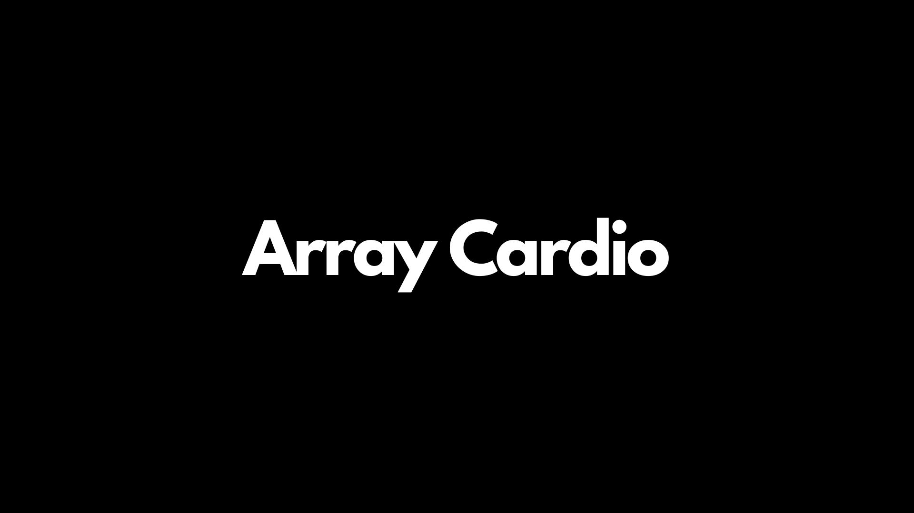
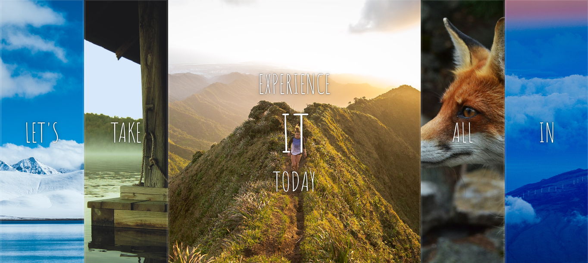
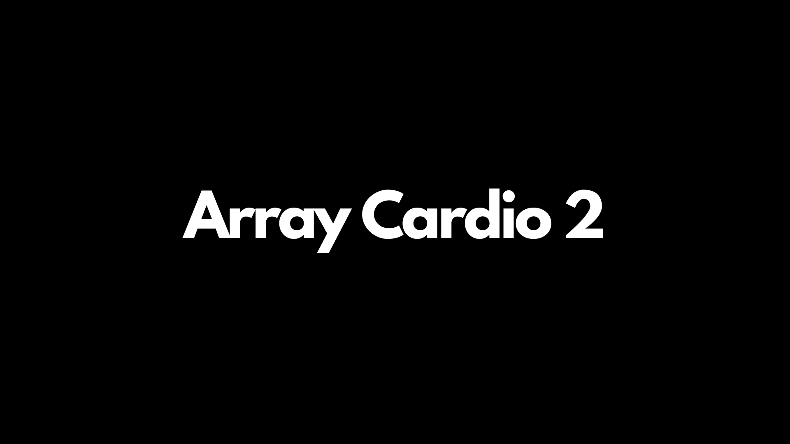
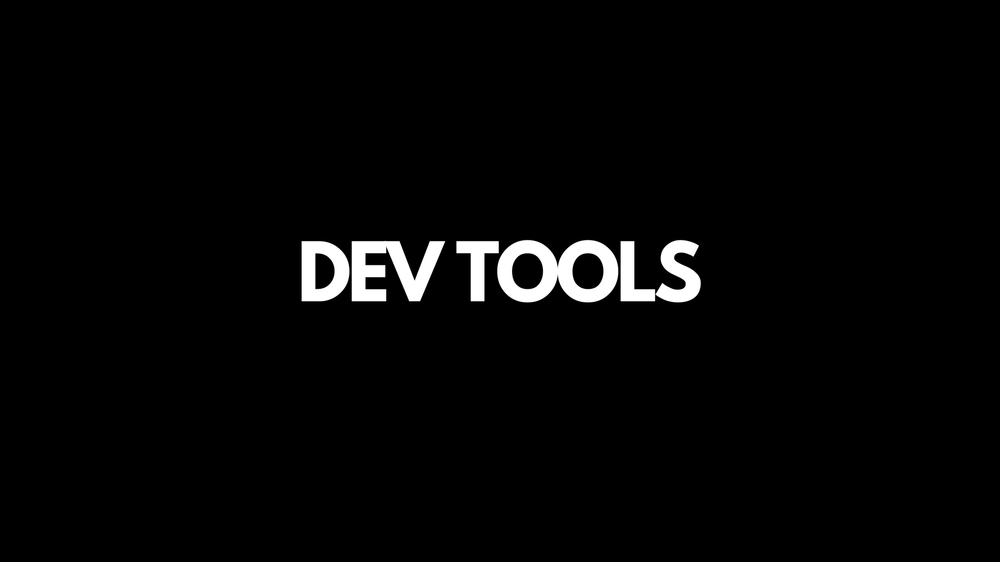

# Javascript-30

This Repository Documents a 30 days JavaScript challenge. where I will be building 30 projects everyday using vanilla JS

### Projects

| Day | Description        | Live Site Link                                                                     | Preview                                                             |
| --- | ------------------ | ---------------------------------------------------------------------------------- | ------------------------------------------------------------------- |
| 1   | JS Drum Stick      | [01 Js Drum Stick](http://fevenseyfu.me/Javascript-30/01-Javascript-drum-kit/)     |  |
| 2   | JS+CSS Clock       | [02 JS+CSS Clock](http://fevenseyfu.me/Javascript-30/02-JS-and-CSS-Clock/)         |  |
| 3   | CSS Variables      | [03 CSS Variable](http://fevenseyfu.me/Javascript-30/03-CSS-Variables/)            |  |
| 4   | Array Cardio Day 1 | [04 Array Cardio-Day 1](http://fevenseyfu.me/Javascript-30/04-Array-Cardio-day-1/) |  |
| 5   | Flex Panel Gallery | [05 Flex Panel Gallery](http://fevenseyfu.me/Javascript-30/05-Flex-Panel-Gallery/) |  |
| 6   | Array Cardio       | [06 Type A Head](http://fevenseyfu.me/Javascript-30/06-Type-Ahead/)                |  |
| 7   | Array Cardio Day 2 | [07 Array Cardio-Day 2](http://fevenseyfu.me/Javascript-30/07-Array-Cardio-Day-2/) |  |
| 8   | Fun with HTML5     | [08 HTML Canvas](http://fevenseyfu.me/Javascript-30/08-Fun-With-HTML5/) |  |
| 9   | Dev Tools Domination    | [09 Console Tricks](http://fevenseyfu.me/Javascript-30/09-Dev-Tools-Domination/) |  |
